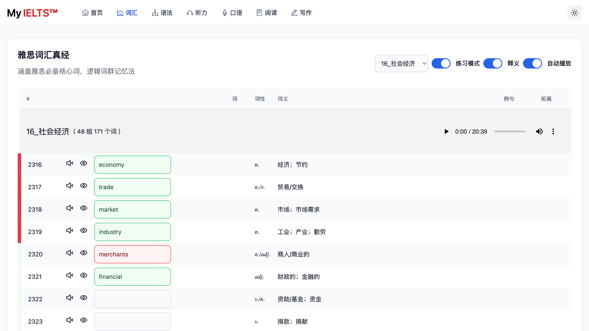
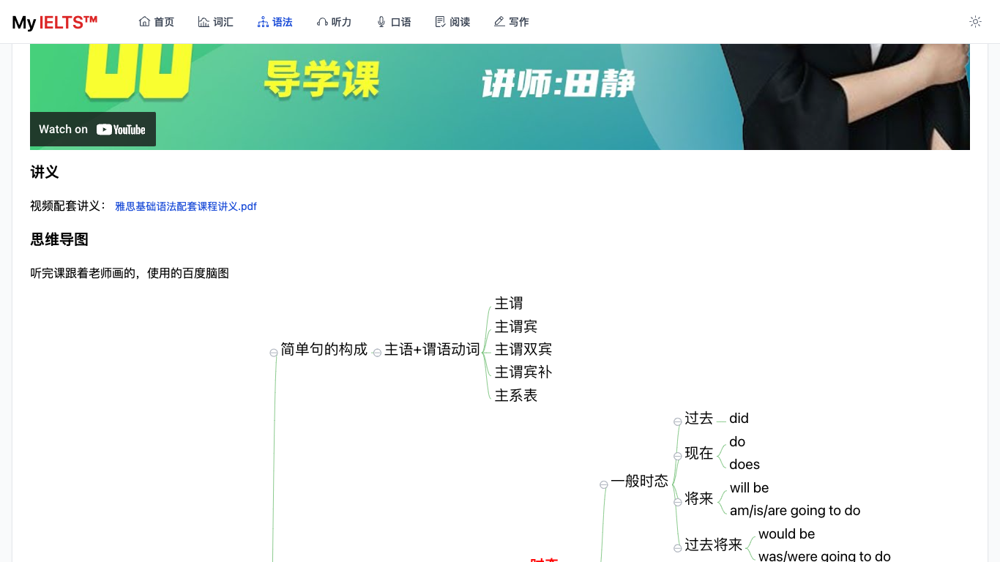
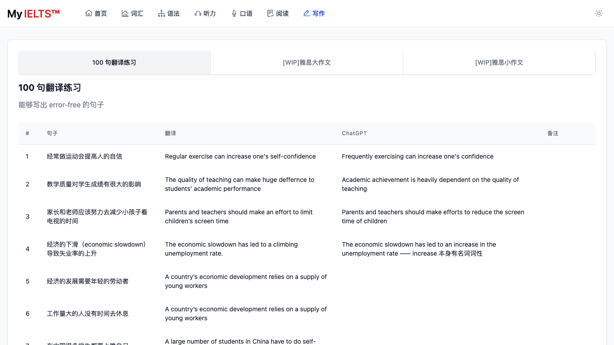

<p><br></p>

<picture>
  <source media="(prefers-color-scheme: dark)" srcset="public/salvation_lies_within_IELTS_dark.svg">
  <source media="(prefers-color-scheme: light)" srcset="public/salvation_lies_within_IELTS_light.svg">
  
</picture>

<p><br></p>
<p><br></p>
<h1 align='center'>
  My <span>IELTS™</span>
</h1>

<h2>在线地址 <a href="https://hefengxian.github.io/my-ielts/#/">https://hefengxian.github.io/my-ielts/</a></h2>

<picture>
  <source media="(prefers-color-scheme: dark)" srcset="public/screenshot/screenshot-home-dark.png">
  <source media="(prefers-color-scheme: light)" srcset="public/screenshot/screenshot-home-light.png">
  
</picture>


## 概述

雅思备考资料，包含词汇、语法、听说读写最出名的一些内容

- [x] 词汇练习模式

## 规划栏目

### 词汇

雅思词汇真经（刘洪波橙色的那本）

- 雅思核心词汇
- 逻辑词群记忆法
- 原书音频

词列表

<picture>
  <source media="(prefers-color-scheme: dark)" srcset="public/screenshot/screenshot-vocabulary-dark.png">
  <source media="(prefers-color-scheme: light)" srcset="public/screenshot/screenshot-vocabulary-light.png">
  
</picture>

练习模式

<picture>
  <source media="(prefers-color-scheme: dark)" srcset="public/screenshot/screenshot-vocabulary-training-mode-dark.png">
  <source media="(prefers-color-scheme: light)" srcset="public/screenshot/screenshot-vocabulary-training-mode-light.png">
  
</picture>

### 语法

新东方雅思语法

- 视频
- 讲义
- 思维导图

<picture>
  <source media="(prefers-color-scheme: dark)" srcset="public/screenshot/screenshot-grammar-dark.png">
  <source media="(prefers-color-scheme: light)" srcset="public/screenshot/screenshot-grammar-light.png">
  
</picture>

### 听力

了解雅思听力，以及考试中的一些基本原则、技巧

- 基本概念和应试技巧
- 听力 179 考点词
- [WIP] 雅思听力王语料库

<picture>
  <source media="(prefers-color-scheme: dark)" srcset="public/screenshot/screenshot-listening-dark.png">
  <source media="(prefers-color-scheme: light)" srcset="public/screenshot/screenshot-listening-light.png">
  
</picture>

### 口语

TODO

### 阅读

- 538 考点词同义替换

<picture>
  <source media="(prefers-color-scheme: dark)" srcset="public/screenshot/screenshot-reading-dark.png">
  <source media="(prefers-color-scheme: light)" srcset="public/screenshot/screenshot-reading-light.png">
  
</picture>


### 写作

写作相关内容，从基础开始

- 顾家北手把手教你雅思写作 V6.0 —— 100 句翻译练习

<picture>
  <source media="(prefers-color-scheme: dark)" srcset="public/screenshot/screenshot-writing-dark.png">
  <source media="(prefers-color-scheme: light)" srcset="public/screenshot/screenshot-writing-light.png">
  
</picture>

## 开发

本项目使用

- [Vitesse Lite](https://github.com/antfu/vitesse-lite) 作为模板开发
- 样式部分参照了 [Flowbite](https://github.com/themesberg/flowbite) & [Flowbite Admin Dashboard](https://flowbite-admin-dashboard.vercel.app)

所以需要对 Vue3、TailWindCSS 有一定的了解才能二次开发

```bash
# 安装依赖
pnpm i

# 开发模式
pnpm run dev

# 构建
pnpm run build
```

## 禁止将本项目用于任何商业目的！！！
